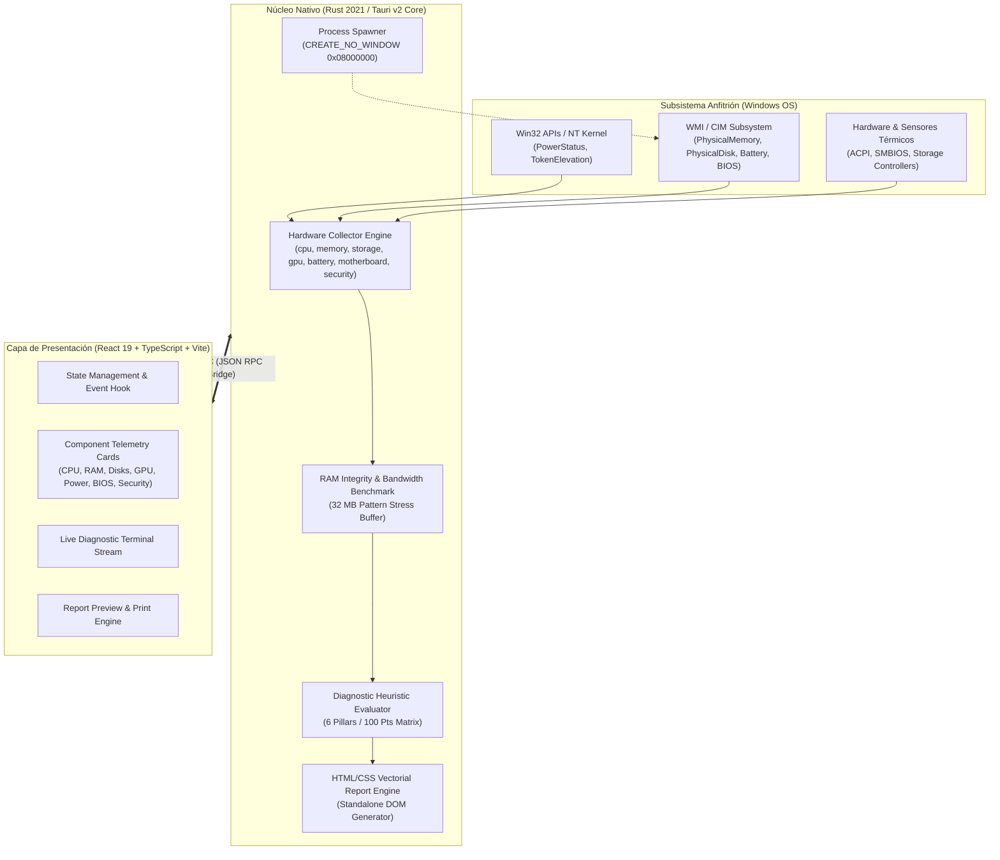

# OmniCheck PC — Motor de Diagnóstico Técnico de Hardware y Auditoría de Sistemas

[](https://github.com/XChris-Z/PCDiagnostic/actions)
[](LICENSE)
[-0078D6.svg?logo=windows)](https://microsoft.com)
[](https://www.rust-lang.org/)
[](https://tauri.app/)
[](https://react.dev/)

**OmniCheck PC** es una suite de diagnóstico de hardware de bajo nivel y auditoría de integridad para entornos Microsoft Windows (10 y 11, x86_64). El sistema combina un núcleo nativo en **Rust** (encapsulado bajo la arquitectura **Tauri v2**) con una interfaz técnica en **React 19 / TypeScript**, ofreciendo telemetría de componentes, pruebas de consistencia de memoria RAM, inspección de salud física SMART, evaluación ponderada de 6 pilares de rendimiento y generación de informes periciales para talleres de soporte técnico y control de calidad.

Diseñado bajo el principio de **cero intrusión**: no requiere servicios residentes en segundo plano, no modifica el registro del sistema, opera 100% desconectado de la red (sin telemetría externa) y utiliza un ejecutable compilado con optimizaciones de espacio y tiempo de enlace (LTO).

---

## 1. Arquitectura del Sistema

El software implementa un modelo de ejecución desacoplado donde la interfaz de usuario se ejecuta en el motor WebView2 del sistema operativo y se comunica con el motor nativo de Rust mediante llamadas de procedimiento remoto asíncronas (IPC) fuertemente tipadas y serializadas con Serde.



---

## 2. Especificación Técnica de los Subsistemas de Sondeo

### 2.1 Topología y Carga de Procesador (`hardware/cpu.rs`)
- **Muestreo Diferencial:** Realiza un refresco específico (`CpuRefreshKind::everything()`) seguido de un intervalo de espera calibrado de 150 ms para calcular el diferencial de ciclos de CPU (`delta`) y determinar la carga global y por núcleo de forma precisa.
- **Detección de Arquitectura:** Discierne la arquitectura binaria subyacente, número de núcleos físicos independientes versus procesadores lógicos (Hyper-Threading / SMT).
- **Sondeo Térmico de Paquete:** Interroga los componentes de sensores térmicos expuestos por ACPI/WMI buscando etiquetas de paquete y matriz (`cpu`, `core`, `package`, `tctl`, `tdie`).

### 2.2 Subsistema de Memoria RAM e Integridad de Bits (`hardware/memory.rs`)
- **Interrogación Física de Módulos (CIM):** Consulta `Win32_PhysicalMemory` para enumerar zócalos DIMM/SO-DIMM individuales, fabricante del chip, capacidad en bytes, frecuencia configurada frente a velocidad máxima de bus, y tipo de memoria SMBIOS (DDR3, DDR4, DDR5, LPDDR).
- **Prueba de Consistencia y Ancho de Banda en Tiempo Real:** Asigna un búfer dinámico de 32 MB en espacio de usuario (`Vec<u8>`). Ejecuta ciclos de escritura secuencial con patrones de prueba pseudoaleatorios (`0xAA`, `0x55`, inversión de bits) seguidos de una fase de lectura y verificación estricta para detectar fallas intermitentes o *bit-flips*, calculando simultáneamente el ancho de banda efectivo de lectura/escritura en MB/s.

### 2.3 Almacenamiento Físico y Telemetría SMART (`hardware/storage.rs`)
- **Correlación Lógica/Física:** Cruza los volúmenes y puntos de montaje del sistema de archivos (`sysinfo::Disks`) con las entidades físicas registradas en `MSFT_PhysicalDisk` de la API de Almacenamiento de Microsoft.
- **Detección de Bus y Tipo de Medio:** Clasifica el tipo de medio físico (NVMe SSD, SATA SSD, HDD Mecánico, USB Flash) y el bus de interfaz (PCIe NVMe, SATA, USB, SCSI).
- **Indicadores de Desgaste:** Extrae el estado de confiabilidad física SMART (`Healthy`, `Warning`, `Unhealthy`), horas de funcionamiento acumuladas (*Power-On Hours*), temperatura operativa del controlador y nivel de desgaste porcentual (*Wear Level %*) en celdas NAND.

### 2.4 Aceleración Gráfica y Adaptadores de Vídeo (`hardware/gpu.rs`)
- **Enumeración de Controladores:** Interroga `Win32_VideoController` para extraer nombre comercial del GPU, procesador de vídeo, versión de controlador instalada y memoria de vídeo asignada (VRAM).
- **Clasificación Dedicada vs. Integrada:** Aplica una heurística basada en la cuota de memoria de vídeo discreta reportada (umbral de 1.5 GB VRAM) y arquitectura del chipset para clasificar adaptadores integrados (Intel UHD/Iris Xe, AMD Radeon Vega/RDNA) versus discretos (NVIDIA GeForce/RTX, AMD Radeon RX, Intel Arc).

### 2.5 Subsistema de Energía y Degradación Electroquímica (`hardware/battery.rs`)
- **Detección Rápida de Topología:** Utiliza la API nativa de Windows `GetSystemPowerStatus` (`windows-sys::Win32::System::Power`) para verificar de forma instantánea si el host es un equipo portátil o una estación de trabajo de escritorio (verificación de bandera `BATTERY_FLAG_NO_BATTERY` o `BatteryLifePercent == 255`).
- **Cálculo de Desgaste de Batería:** En equipos portátiles, consulta `Win32_Battery` y las tablas WMI de gestión de energía para comparar la **Capacidad de Diseño de Fábrica** ($Cap_{design}$) con la **Capacidad Máxima a Carga Completa Actual** ($Cap_{full}$):
  $$\text{Nivel de Desgaste (\%)} = \left( \frac{Cap_{design} - Cap_{full}}{Cap_{design}} \right) \times 100$$
- **Bypass Automático en Escritorios:** Si el equipo no posee batería física, el módulo se inhabilita de manera limpia sin generar penalizaciones en la evaluación.

### 2.6 Placa Base y Firmware de Plataforma (`hardware/motherboard.rs`)
- **Datos de Identificación SMBIOS:** Inspecciona `Win32_BaseBoard` y `Win32_BIOS` para capturar el fabricante de la placa, modelo comercial, número de serie de chasis, proveedor de BIOS, revisión de versión y fecha de compilación del firmware.
- **Modo de Arranque de Firmware:** Identifica si el sistema arrancó en modo UEFI moderno o en compatibilidad Legacy BIOS.

### 2.7 Seguridad, Plataforma y Privilegios (`hardware/security.rs`)
- **Inspección de Solución Antimalware:** Consulta el espacio de nombres `root\SecurityCenter2` (`AntiVirusProduct`) para identificar el software de protección activo (Windows Defender, CrowdStrike, ESET, Bitdefender, etc.) y su estado de actualización.
- **Estado de Aislamiento de Red:** Verifica el estado operativo del Firewall de Windows en los perfiles de red.
- **Atestación de Plataforma:** Comprueba la disponibilidad del módulo de plataforma segura (TPM 2.0 / TPM 1.2) mediante `Get-Tpm` y el estado de arranque seguro (*Secure Boot*).
- **Verificación de Elevación de Token:** Utiliza `OpenProcessToken` y `GetTokenInformation` con `TokenElevation` para notificar al operador técnico si el proceso cuenta con privilegios administrativos (`High IL / Admin`) o estándar.

---

## 3. Matriz Ponderada de Evaluación (Algoritmo de Puntuación)

El motor (`hardware/evaluator.rs`) calcula un **Índice Global de Salud de 0 a 100 puntos**, distribuido en 6 pilares ponderados de acuerdo a su impacto en la estabilidad de hardware:

| Pilar de Diagnóstico | Puntos Máx. | Condiciones de Penalización y Deducción | Estado Resultante |
| :--- | :---: | :--- | :---: |
| **Procesador (CPU)** | 20 | Temp $\ge 90^\circ\text{C}$ (Deducción: -15 pts)<br>Temp $\ge 80^\circ\text{C}$ (Deducción: -6 pts)<br>Uso sostenido $> 95\%$ sin carga controlada (-6 pts) | `CRITICAL`<br>`WARNING`<br>`WARNING` |
| **Memoria RAM & Integridad** | 20 | Fallo en prueba de consistencia de bits (-20 pts)<br>Saturación de memoria virtual $\ge 92\%$ (-6 pts) | `CRITICAL`<br>`WARNING` |
| **Almacenamiento & SMART** | 20 | Alerta de degradación SMART / sectores reasignados (-16 pts)<br>Ocupación de volumen $\ge 95\%$ (-12 pts)<br>Ocupación de volumen $\ge 88\%$ (-6 pts) | `CRITICAL`<br>`CRITICAL`<br>`WARNING` |
| **Aceleración Gráfica (GPU)** | 15 | Temperatura de núcleo GPU $\ge 88^\circ\text{C}$ (-6 pts por adaptador) | `WARNING` |
| **Seguridad & SO** | 15 | Antivirus ausente o inactivo (-7 pts)<br>Firewall de Windows deshabilitado (-5 pts) | `WARNING` |
| **Placa Base & BIOS** | 10 | Fabricante de placa base no identificado / genérico (-2 pts) | `WARNING` |

### Clasificación Final del Equipo
- **ÓPTIMO (88 - 100 pts):** Todos los subsistemas operan dentro de sus tolerancias térmicas y métricas nominales de fábrica, sin alertas SMART ni inconsistencias de memoria.
- **PRECAUCIÓN (65 - 87 pts):** El hardware es funcional pero presenta alertas de mantenimiento preventivo (temperaturas elevadas, volumen próximo al límite de capacidad o batería con desgaste superior al 25%).
- **CRÍTICO (< 65 pts o cualquier bandera crítica activa):** Se detectó riesgo inminente de fallo de hardware, pérdida de datos (alerta SMART no corregible) o corrupción de memoria RAM.

---

## 4. Generación de Informes Periciales de Taller

El módulo `report_pdf.rs` implementa un generador autónomo de reportes en formato **HTML5 / CSS3 estricto**, optimizado para impresión vectorial y exportación a PDF mediante el motor nativo del navegador del sistema operativo.

### Propiedades del Informe:
1. **Identificador Único Criptográfico:** Cada reporte genera un identificador con prefijo temporal y hash de host (`OMNI-YYYYMMDD-XXXX-XXXX`).
2. **Metadatos de Taller:** Permite parametrizar el nombre del cliente, técnico a cargo, identificador de equipo en taller y bloque de observaciones del servicio técnico.
3. **Estilos `@media print` Calibrados:** Diseñado para respetar saltos de página (`page-break-inside: avoid`), márgenes estandarizados A4/Carta, tablas técnicas con paleta de alto contraste para impresión monocromática o color y firmas de conformidad técnica.
4. **Almacenamiento Local Directo:** El reporte se almacena directamente en el Escritorio del usuario (`Reporte_OmniCheck_<PC>_<ID>.html`) y se lanza automáticamente en el visor predeterminado de Windows mediante `cmd.exe /C start` sin ventanas parásitas.

---

## 5. Especificación de la Interfaz IPC (Tauri Commands)

La comunicación entre el frontend y el backend de Rust se realiza mediante los siguientes comandos registrados en el invocador de Tauri:

```rust
// 1. Ejecuta el ciclo completo de sondeo y evaluación
#[tauri::command]
fn get_system_diagnostics() -> Result<SystemDiagnostics, String>;

// 2. Serializa los resultados a informe HTML y lo guarda en disco
#[tauri::command]
fn export_pdf_report(diagnostics: SystemDiagnostics) -> Result<String, String>;

// 3. Genera la cadena HTML en memoria para renderizado en el modal de previsualización
#[tauri::command]
fn get_html_report_content(diagnostics: SystemDiagnostics) -> Result<String, String>;
```

### Estructura de Datos Central (`models.rs` $\leftrightarrow$ `diagnostics.ts`)
```typescript
interface SystemDiagnostics {
  report_id: string;
  timestamp: string;
  hostname: string;
  health_score: number;
  health_status: 'OPTIMAL' | 'WARNING' | 'CRITICAL';
  is_admin: boolean;
  is_portable: boolean;
  cpu: CpuInfo;
  motherboard: MotherboardInfo;
  ram: RamInfo;
  storage: DiskInfo[];
  gpus: GpuInfo[];
  battery: BatteryInfo | null;
  network: NetworkInterface[];
  security: OsSecurityInfo;
  diagnostic_log: LogEntry[];
  recommendations: TechnicalRecommendation[];
  score_breakdown: ScoreBreakdown;
  client_name?: string;
  technician_name?: string;
  custom_pc_name?: string;
  service_notes?: string;
}
```

---

## 6. Prevención de Ruido Visual en Subprocesos (`CREATE_NO_WINDOW`)

Para evitar que las consultas WMI / CIM o llamadas a PowerShell provoquen parpadeos de consolas negras en la pantalla del usuario durante el diagnóstico, todas las llamadas a procesos externos se canalizan mediante `utils::new_hidden_command`:

```rust
#[cfg(windows)]
pub fn new_hidden_command(program: &str) -> std::process::Command {
    use std::os::windows::process::CommandExt;
    let mut cmd = std::process::Command::new(program);
    // 0x08000000 = CREATE_NO_WINDOW
    // Suprime la creación de ventanas de consola secundarias en Windows
    cmd.creation_flags(0x08000000);
    cmd
}
```

Adicionalmente, el ejecutable final contiene el atributo `#![cfg_attr(not(debug_assertions), windows_subsystem = "windows")]` en `main.rs`, garantizando que la aplicación se lance como un binario de GUI puro sin consola acoplada.

---

## 7. Requisitos y Entorno de Compilación

### Requisitos del Sistema Operativo
- **SO de Desarrollo y Despliegue:** Microsoft Windows 10 (1809+) o Windows 11 (x86_64).
- **Runtime:** Microsoft Edge WebView2 Evergreen Runtime (incorporado de serie en Windows 10/11).

### Dependencias de Herramientas
1. **Rust Toolchain:** `stable-x86_64-pc-windows-msvc` (1.78 o superior).
2. **Microsoft C++ Build Tools:** C++ x86/x64 Build Tools (MSVC v143+) y Windows SDK 10/11.
3. **Node.js:** Versión 20.x o 22.x LTS y gestor `npm`.

---

## 8. Guía de Compilación y Generación de Binarios

### 8.1 Clonación e Instalación de Dependencias
```bash
git clone https://github.com/XChris-Z/PCDiagnostic.git
cd PCDiagnostic
npm install
```

### 8.2 Ejecución en Entorno de Desarrollo (Live Reloading)
Inicia el servidor de desarrollo de Vite junto al entorno de pruebas de Tauri:
```bash
npm run tauri dev
```

### 8.3 Compilación de Binarios de Producción

El proyecto incluye perfiles de compilación optimizados en `Cargo.toml` con `opt-level = 3`, `lto = true`, `codegen-units = 1` y `strip = true`:

```bash
# 1. Compilar binario ejecutable portable independiente (.exe sin instalador)
npm run build:portable
# Ubicación resultante: src-tauri/target/release/omnicheck-pc.exe

# 2. Generar paquete instalador de Windows MSI (Windows Installer)
npm run build:msi
# Ubicación resultante: src-tauri/target/release/bundle/msi/

# 3. Generar instalador asistido estándar NSIS (.exe de instalación)
npm run build:setup
# Ubicación resultante: src-tauri/target/release/bundle/nsis/
```

---

## 9. Estructura del Repositorio

```text
PCDiagnostic/
├── .github/
│   └── workflows/
│       └── ci.yml               # Pipeline de integración continua (build & test)
├── src-tauri/                   # Núcleo de Hardware y Sistema en Rust
│   ├── Cargo.toml               # Dependencias de Rust, crates del sistema y perfil LTO
│   ├── tauri.conf.json          # Configuración de ventana, esquemas y empaquetado Tauri v2
│   ├── build.rs                 # Script de compilación de recursos Tauri
│   └── src/
│       ├── main.rs              # Punto de entrada y directiva windows_subsystem
│       ├── lib.rs               # Registro de comandos Tauri e integración de plugins
│       ├── models.rs            # Estructuras de datos de telemetría y diagnóstico (Serde)
│       ├── utils.rs             # Invocador de procesos con flag CREATE_NO_WINDOW
│       ├── report_pdf.rs        # Motor de maquetación HTML/CSS e impresión técnica
│       └── hardware/            # Módulos de interrogación de bajo nivel
│           ├── mod.rs           # Orquestador del ciclo de diagnóstico
│           ├── cpu.rs           # Muestreo diferencial de CPU y sensores térmicos
│           ├── memory.rs        # Consulta CIM de DIMMs y benchmark de consistencia
│           ├── storage.rs       # Detección de volúmenes, bus físico y telemetría SMART
│           ├── gpu.rs           # Clasificación de adaptadores gráficos y VRAM
│           ├── battery.rs       # Interrogación Win32 PowerStatus y degradación química
│           ├── motherboard.rs   # Lectura de BIOS, placa base y modo UEFI
│           ├── network.rs       # Adaptadores de red, direcciones MAC e IP
│           ├── security.rs      # Antivirus, Firewall, TPM 2.0 y token de elevación
│           └── evaluator.rs     # Algoritmo de evaluación ponderada y recomendaciones
├── src/                         # Capa de Presentación en React 19 + TypeScript
│   ├── index.css                # Sistema de diseño con Tailwind CSS v4
│   ├── main.tsx                 # Entrada de la aplicación React
│   ├── App.tsx                  # Componente raíz, orquestación de estado y vistas
│   ├── types/
│   │   └── diagnostics.ts       # Esquemas TypeScript de modelos de diagnóstico
│   └── components/
│       ├── Header.tsx           # Barra de estado superior, score global y badges
│       ├── ActionBar.tsx        # Acciones de re-escaneo, exportación y datos de taller
│       ├── TerminalConsole.tsx  # Consola interactiva de registro de eventos
│       ├── cards/               # Tarjetas modulares de telemetría por subsistema
│       │   ├── CpuCard.tsx
│       │   ├── MemoryCard.tsx
│       │   ├── StorageCard.tsx
│       │   ├── GpuCard.tsx
│       │   ├── BatteryCard.tsx
│       │   ├── MotherboardCard.tsx
│       │   ├── NetworkCard.tsx
│       │   ├── SecurityCard.tsx
│       │   ├── RecommendationsCard.tsx
│       │   └── ScoreBreakdownCard.tsx
│       └── modals/              # Ventanas modulares del sistema
│           ├── ReportPreviewModal.tsx  # Previsualizador e impresor técnico
│           ├── AboutModal.tsx          # Ficha técnica y licencias
│           └── HelpModal.tsx           # Guía de interpretación de métricas
├── package.json                 # Scripts de desarrollo y dependencias npm
├── tsconfig.json                # Configuración del compilador TypeScript
├── vite.config.ts               # Configuración del bundler Vite con React y Tailwind
├── CONTRIBUTING.md              # Estándares de desarrollo y directrices para PRs
├── SECURITY.md                  # Modelo de permisos y política de divulgación
└── LICENSE                      # Licencia no comercial con regalías comerciales
```

---

## 10. Consideraciones de Seguridad y Privacidad

- **Acceso Exclusivo de Solo Lectura:** El software realiza operaciones de consulta de telemetría sin modificar registros del sistema, firmwares de controladores ni tablas NVRAM/UEFI.
- **Buffer Aislado de Memoria:** La prueba de memoria opera en un espacio de memoria virtual asignado dinámicamente en modo usuario, garantizando el aislamiento de memoria respecto a otros procesos en ejecución.
- **Funcionamiento 100% Desconectado:** La aplicación no realiza peticiones HTTP/HTTPS externas, no descarga scripts remotos ni recolecta telemetría analítica. Cumple con requerimientos de auditoría en infraestructuras *air-gapped*.

---

## 11. Licencia y Términos Comerciales

Este proyecto se distribuye bajo una **Licencia de Código Disponible No Comercial y Regalías Comerciales (*Source-Available Non-Commercial & Commercial Royalty License*)**:

1. **Uso No Comercial (Gratuito):** Se autoriza el uso libre para fines personales, domésticos, educativos, de investigación y auditoría técnica individual sin cobro por el software.
2. **Uso Comercial y Reparto de Ganancias (*Revenue Share*):** Queda estrictamente prohibida la venta, distribución con fines de lucro, cobro por licenciamiento o empaquetado en soluciones comerciales sin un acuerdo previo por escrito con el autor.
3. **Licenciamiento Comercial:** Para solicitar una licencia comercial o acordar un esquema de regalías / *revenue share*, contactar a:
   - **Autor:** Christian Lemus (XChris-Z)
   - **Correo electrónico:** [christ.lemus2001@gmail.com](mailto:christ.lemus2001@gmail.com)

Consulte el archivo [LICENSE](LICENSE) para conocer el texto legal completo.
